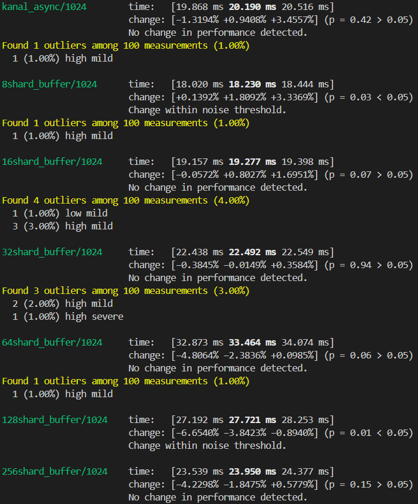

# lf-shardedringbuf
An async, lock-free, sharded, cache-aware SPSC/MPSC/MPMC ring buffer in Rust.

# Features
* It uses multiple smaller simple ring buffers each with capacity = requested capacity / # of shards (each ring buffer is considered a shard)
* It is lock-free; only uses atomic primitives and no mutexes or rwlocks
* False sharing is avoided through cache padding the shards
* It uses tokio's task local variables as a shard index reference and to remember the shard acquistion policy strategy to take for tasks to effectively acquire a shard to enqueue/dequeue on.
* ~~Exponential backoff + random jitter (capped at 20 ms) used to yield CPU in functions that loops.~~
    * This backoff method was removed since it introduced a bit more delay; instead, full sweep around the shards calls tokio's `yield_now()` function to put the running task to the back of the scheduled list
* Different shard acquisition policies are provided: `Sweep`, `RandomAndSweep`, and `ShiftBy` (see `src/task_local_spawn.rs` for more info) 
* It can perform in an async multithreaded or single threaded environment (optimal for multiple producer, multiple consumer situations)

# Example Usage
The following are examples of how to use LFShardedRingBuf:

If enqueue and dequeue tasks are done with a limited number of enqueue/dequeue operations
```rust
    let max_items = 1024;
    let shards = 8;
    let rb: Arc<LFShardedRingBuf<usize>> = Arc::new(LFShardedRingBuf::new(max_items, shards));

    let mut deq_threads = Vec::with_capacity(MAX_TASKS);
    let mut enq_threads = Vec::with_capacity(MAX_TASKS);

    // spawn enq tasks with shift by policy
    for i in 0..MAX_TASKS {
        let rb = Arc::clone(&rb);
        let handler: tokio::task::JoinHandle<()> = spawn_buffer_task(
            ShardPolicy::ShiftBy {
                initial_index: Some(i),
                shift: MAX_TASKS,
            },
            async move {
                for i in 0..ITEM_PER_TASK {
                    rb.enqueue(i).await;
                }
            },
        );
        enq_threads.push(handler);
    }

    // spawn deq tasks with shift by policy
    for i in 0..MAX_TASKS {
        let rb = Arc::clone(&rb);
        let handler: tokio::task::JoinHandle<usize> = spawn_buffer_task(
            ShardPolicy::ShiftBy {
                initial_index: Some(i),
                shift: MAX_TASKS,
            },
            async move {
                let mut counter: usize = 0;
                for _i in 0..ITEM_PER_TASK {
                    let item = rb.dequeue().await;
                    match item {
                        Some(_) => counter += 1,
                        None => break,
                    }
                }
                counter
            },
        );
        deq_threads.push(handler);
    }

    // Wait for enqueuers
    for enq in enq_threads {
        enq.await.unwrap();
    }

    // Wait for dequeuers
    for deq in deq_threads {
        deq.await.unwrap();
    }
```

If dequeue tasks are performing in a loop and enqueue task(s) is performing with limited operations
```rust
    const MAX_ITEMS: usize = 100;
    const MAX_SHARDS: usize = 10;
    const MAX_TASKS: usize = 5;
    let rb: Arc<LFShardedRingBuf<usize>> = Arc::new(LFShardedRingBuf::new(MAX_ITEMS, MAX_SHARDS));
    let mut deq_threads = Vec::with_capacity(MAX_TASKS.try_into().unwrap());
    let mut enq_threads = Vec::new();

    // Spawn MAX_TASKS dequeuers *tasks*
    for i in 0..MAX_TASKS {
        let rb = Arc::clone(&rb);
        let handler = spawn_buffer_task(
            ShardPolicy::ShiftBy {
                initial_index: Some(i),
                shift: MAX_TASKS,
            },
            async move {
                let rb = rb.clone();
                let mut counter: usize = 0;
                loop {
                    let item = rb.dequeue().await;
                    match item {
                        Some(_) => counter += 1,
                        None => break,
                    }
                }
                counter
            },
        );
        deq_threads.push(handler);
    }

    // Just spawn a single enqueuers task
    {
        let rb = Arc::clone(&rb);
        let enq_handler = spawn_buffer_task(
            ShardPolicy::Sweep {
                initial_index: None,
            },
            async move {
                let rb = rb.clone();
                for _i in 0..2 * MAX_ITEMS {
                    rb.enqueue(20).await;
                }
            },
        );
        enq_threads.push(enq_handler);
    }

    for enq in enq_threads {
        enq.await.unwrap();
    }

    // poison for dequer tasks to exit gracefully, completing any remaining jobs
    // on the buffer 
    rb.poison().await;

    let mut items_taken: usize = 0;
    while let Some(curr_thread) = deq_threads.pop() {
        items_taken += curr_thread.await.unwrap();
    }
```
If enqueuers tasks need be in a loop, you can use the `async_stream` crate and hook up enqueuers tasks to a stream, where you can denote that a `None` value returned by the stream means that it terminated.

# Benchmark Results
I tried benchmarking this ring buffer (and comparing it with kanal async) with the following parameters:
* 4 tasks for enqueuing and 4 tasks for dequeuing (each iterating through 250,000 usize)
* 8 worker threads
* Total capacity of the buffer is 1024 entries
* Varying shards value I experimented on starting (8, 16, 32, 64, 128) using a ShiftBy policies with enqueuers tasks operating on shard index 0-3 initially respectively, dequeuers tasks operating on shard index 0-3 respectively with a shift of 4.

The following are timing results using `cargo bench` with varying shards in the order mentioned above (with barrier synchronization respectively):




<!-- 


 -->

Typical best performance for this buffer seems to come from matching the number of shards with the maximum number of enqueuers/dequeuers tasks spawned and then using ShiftBy policy ensuring that each enqueuers tasks and dequeuers tasks are at a unique initial index with respect to each other enqueuers/dequeuers task with the ideal shift for each enqueuers/dequeuers task being the number of enqueuers/dequeuers tasks spawned respectively (i.e. if you spawned 5 dequeuers tasks, you want each task to have an initial shard index of 0, ..., 4 with a shift 5 and if you spawned 10 enqueuers tasks, you want each task to have an intial shard index of 0, ..., 9 with a shift of 10).

# Future Additions/Thoughts
* Enqueuing/Dequeuing items in batches to take advantage of Auto-Vectorization compiler optimizations
* Play around with shard acquiring policies, so there are fewer failing calls to `self.shard_jobs[current].occupied.compare_exchange(false, true, Ordering::Acquire, Ordering::Relaxed).is_ok()`. For example, introduce a `SweepBy` and `SweepAndShiftBy` policies so that the task is yielded through less attempts of acquiring a shard.

# Contribution
If you'd like to contribute (be it through documentation, testing, providing feedback), feel free to do so!

# License
This project is licensed under the [MIT License](LICENSE).
