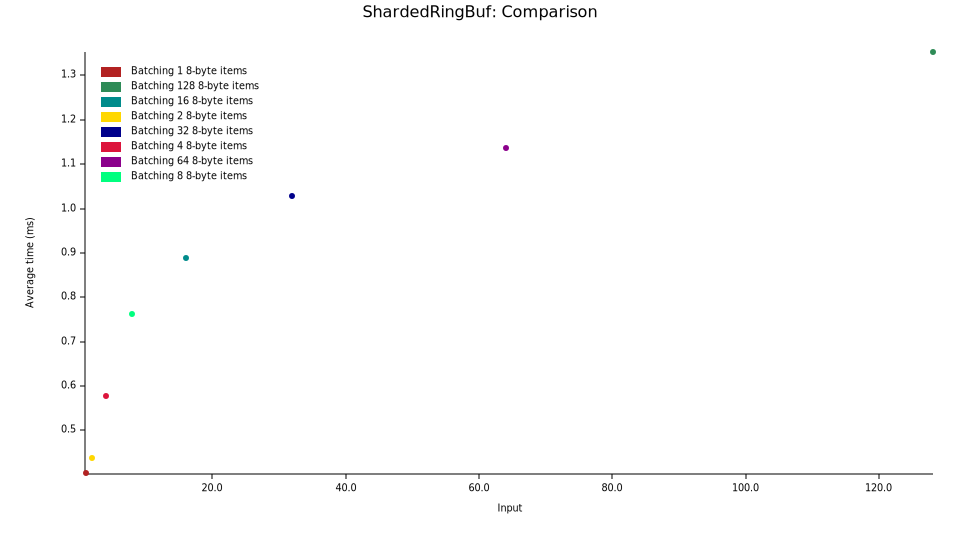

[](https://github.com/asder8215/sharded_ringbuf)
[](https://crates.io/crates/sharded_ringbuf)
[](https://docs.rs/sharded_ringbuf/latest/sharded_ringbuf/)

# sharded_ringbuf
An async, sharded SPSC/MPSC/MPMC ring buffer in Rust.

# Example Usage
The following are examples of how to use ShardedRingBuf:

If you want to enqueue one item per task at a time:
```rust
async fn enq_example(
    msg_vec: Vec<BigData>,
    shards: usize,
    task_count: usize,
) {
    let shards = 8;
    let rb = ShardedRingBuf::new(1024, shards);

    let mut deq_tasks = Vec::with_capacity(shards);
    let mut enq_tasks = Vec::with_capacity(task_count);

    // enqueuing batches of items per task 
    for msg in msg_vec {
        let handle = tokio::spawn({
            let rb_clone = rb.clone();
            async move {
                rb_clone.enqueue(msg).await;
            }
        });
        enq_tasks.push(handle);
    }

    for i in 0..shards {
        let handle = tokio::spawn({
            let rb_clone = rb.clone();
            async move {
                loop {
                    match rb_clone.dequeue_full_in_shard(i).await {
                        Some(item) => {
                            // can perform some work on dequeue item
                        }
                        None => break,
                    }
                }
            }
        });
        deq_tasks.push(handle);
    }

    // Wait for enqueuers to complete
    for enq in enq_tasks {
        enq.await.unwrap();
    }

    rb.poison();

    // necessary for poison
    let notifier_task = spawn({
        let rb_clone = rb.clone();
        async move {
            loop {
                for i in 0..shards {
                    rb_clone.notify_dequeuer_in_shard(i % rb_clone.get_num_of_shards());
                }
                yield_now().await;
            }
        }
    });

    // Wait for dequeuers to complete
    for deq in deq_tasks {
        deq.await.unwrap();
    }

    notifier_task.abort();
}
```

If you want to enqueue multiple items per task:
```rust
async fn enq_batching_example(
    msg_vecs: Vec<Vec<BigData>>,
    shards: usize,
    task_count: usize,
) {
    let shards = 8;
    let rb = ShardedRingBuf::new(1024, shards);

    let mut deq_tasks = Vec::with_capacity(shards);
    let mut enq_tasks = Vec::with_capacity(task_count);

    // enqueuing batches of items per task 
    for msg_vec in msg_vecs {
        let handle = tokio::spawn({
            let rb_clone = rb.clone();
            async move {
                rb_clone.enqueue_full(msg_vec).await;
            }
        });
        enq_tasks.push(handle);
    }

    for i in 0..shards {
        let handle = tokio::spawn({
            let rb_clone = rb.clone();
            async move {
                loop {
                    match rb_clone.dequeue_full_in_shard(i).await {
                        Some(items) => {
                            for _i in items {
                            }
                        }
                        None => break,
                    }
                }
            }
        });
        deq_tasks.push(handle);
    }

    // Wait for enqueuers to complete
    for enq in enq_tasks {
        enq.await.unwrap();
    }

    rb.poison();

    // necessary for poison
    let notifier_task = spawn({
        let rb_clone = rb.clone();
        async move {
            loop {
                for i in 0..shards {
                    rb_clone.notify_dequeuer_in_shard(i % rb_clone.get_num_of_shards());
                }
                yield_now().await;
            }
        }
    });

    // Wait for dequeuers to complete
    for deq in deq_tasks {
        deq.await.unwrap();
    }

    notifier_task.abort();
}
```
You can also take a look at the `tests/` or `benches/` directory to see examples on how to use this structure. 

# Benchmark Results
Benchmarking ShardedRingBuf was done with 8 threads, 8 shards, 1024 total capacity (128 capacity per shard), and 1000 enqueuer tasks alongisde a looping dequeuer task per shard with varying number of items being batched (1, 2, 4, 8, 16, 32, 64, 128 8-byte items). This was compared to Kanal Async, which operated under 1024 total capacity, 8 threads, and 1000 enqueuer tasks alongside one looping receiver task with varying number of items being batched (1, 2, 4, 8, 16, 32, 64, 128 8-byte items).

Machine: AMD Ryzen 7 5800X 3.8 GHz 8-Core Processor

Rust: rustc rustc 1.88.0 (17067e9ac 2025-05-09)

The following graphs are results generated from Criterion:



The x-axis are batching input sizes per task for 1000 tasks and the y-axis is how long it took to complete the following work in milliseconds.

For more detailed results on iterations and each batching input size, then you can take a look at the `report/index.html` within the `benchmark_res/kanal async/` or `benchmark_res/shardedringbuf/`folder.

Interestingly, the results shows that ShardedRingBuf benefits highly from tasks batching items than one item at a time. You can imagine ShardedRingBuf benefitting situations involving batching multiple transactions or messages into one task and processing them like so instead of processing one transaction/message per task. 

# Future Additions/Thoughts
* Implement thread-safe methods for cloning, printing, and enq/deq index methods (currently there are only relaxed methods for this)
* More benchmarking to be added
* Better documentation

# Contribution
All contributions (i.e. documentation, testing, providing feedback) are welcome! Check out [CONTRIBUTING.md](CONTRIBUTING.md) on how to start.

# License
This project is licensed under the [MIT License](LICENSE-MIT) and [Apache License](LICENSE-APACHE).
