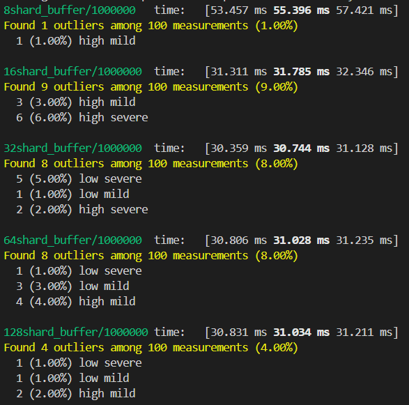
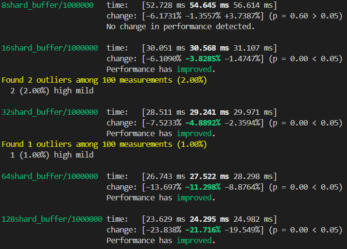

# lf-shardbuf
A lock-free, sharded, cache-aware MPMC ring buffer for Rust. Performant for high concurrency and async.

# Features
* It uses multiple smaller simple ring buffers each with capacity = requested capacity / # of shards (each ring buffer is considered a shard)
* It is lock-free; only uses atomic primitives and no mutexes or rwlocks
* False sharing is avoided through cache padding the shards
* It uses tokio's task local variables as a shard index reference for tasks to effectively acquire a shard to enqueue/dequeue on (moves in a ring buffer like manner).
* Exponential backoff + random jitter (capped at 20 ms) used to yield CPU in functions that loops.
* It can perform in an async multithreaded or single threaded environment (optimal for multiple producer, multiple consumer situations though)

# Benchmark Results
Benchmarking was performed in a similar style to [Rust Channel Benchmarks](https://github.com/fereidani/rust-channel-benchmarks/tree/main). However, look at [Kanal Repository](https://github.com/fereidani/kanal?tab=readme-ov-file) for an updated benchmark timing on all the top repos. Moreover, I only tested it on the Bounded Channel with Size N in MPMC usize case. In essence, I used:
* 4 tasks for enqueuing and 4 tasks for dequeuing (each iterating through 250,000 usize)
* 8 worker threads
* Total capacity of the buffer is 1,000,000 entries
* Varying shards value I experimented on starting (8, 16, 32, 64, 128)

The following are timing results using `cargo bench` with varying shards in the order mentioned above (with and without barrier synchronization respectively):

In the with barrier scenario:
* 8 shards ~ can possibly handle ~36.10 million operations per sec
* 16 shards ~ can possibly handle ~62.92 million operations per sec
* 32 shards ~ can possibly handle ~65.05 million operations per sec
* 64 shards ~ can possibly handle ~64.46 million operations per sec
* 128 shards ~ can possibly handle ~64.45 million operations per sec

In the without barrier scenario:
* 8 shards ~ can possibly handle ~36.60 million operations per sec
* 16 shards ~ can possibly handle ~65.43 million operations per sec
* 32 shards ~ can possibly handle ~68.40 million operations per sec
* 64 shards ~ can possibly handle ~72.67 million operations per sec
* 128 shards ~ can possibly handle ~82.32 million operations per sec

Note: An operation here means either an enqueue or dequeue

The barrier synchronization has an effect in the code because otherwise the dequeue tasks are likely to trigger the backoff policy and sleep initally. With increasing shard count, there are more unoccupied shards that an enquerer can put its item in and less conflicts with the dequerer or other enquerer tasks acquiring the shard. In fact, it's actually the dequerer that may experience a delay because it keeps acquiring the shards too quickly only to find out that the shard has no jobs inside (more `self.shard_jobs[current].occupied.compare_exchange(false, true, Ordering::Acquire, Ordering::Relaxed).is_ok()` calls). In the future, I may need to plan out better ways for a dequerer task to be given a shard that has a job inside.

# Future Additions/Thoughts
* Enqueuing/Dequeuing items in batches to take advantage of Auto-Vectorization compiler optimizations
* Play around with shard acquiring policies, so there are fewer failing calls to `self.shard_jobs[current].occupied.compare_exchange(false, true, Ordering::Acquire, Ordering::Relaxed).is_ok()`.
* Backoff policies may be experimented on in a lower shard + higher thread/task environment.
