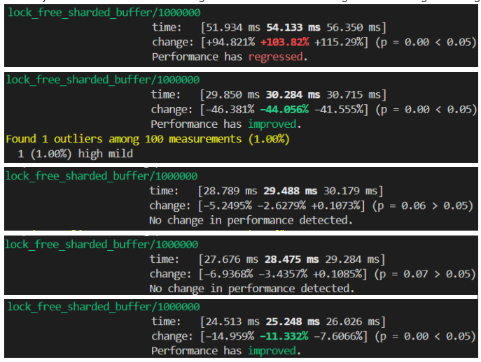

# lf-shardbuf
A lock-free, sharded, cache-aware MPMC ring buffer for Rust. Performant for high concurrency and async.

# Features
* It uses multiple smaller simple ring buffers each with capacity = requested capacity / # of shards (each ring buffer is considered a shard)
* It is lock-free; only uses atomic primitives and no mutexes or rwlocks
* False sharing is avoided through cache padding the shards
* It uses tokio's task local variables as a shard index reference for tasks to effectively acquire a shard to enqueue/dequeue on (moves in a ring buffer like manner).
* Exponential backoff + random jitter (capped at 20 ms) used to yield CPU in functions that loops.
* It can perform in an async multithreaded or single threaded environment (optimal for multiple producer, multiple consumer situations though)

# Benchmark Results
Benchmarking was performed in a similar style to [Rust Channel Benchmarks](https://github.com/fereidani/rust-channel-benchmarks/tree/main). However, I only tested it on the Bounded Channel with Size N in MPMC usize case. In essence, I used:
* 4 tasks respectively for enqueuing and dequeuing (each iterating through 250,000 usize)
* 8 worker threads
* Total capacity of the buffer is 1,000,000 entries
* Varying shards value I experimented on starting (8, 16, 32, 64, 128)

The following are timing results using cargo bench with varying shards in the order mentioned above:

With 8 shards, it seems like the ring buffer I designed can handle 18.47 millions operations (enqueue + dequeue pair) per sec, and with 128 shards, it seems like the ring buffer I designed can handle 40 millions operations per sec in an async MPMC usize situation, which seems to contend with many well-known concurrency related data structure crates in Rust for MPMC.

# Future Additions/Thoughts
* Enqueuing/Dequeuing items in batches to take advantage of Auto-Vectorization compiler optimizations
* Play around with shard acquiring policies, so there are fewer failing calls to `self.shard_jobs[current].occupied.compare_exchange(false, true, Ordering::Acquire, Ordering::Relaxed).is_ok()`.
* Backoff policies may be experimented on in a lower shard + higher thread/task environment.
